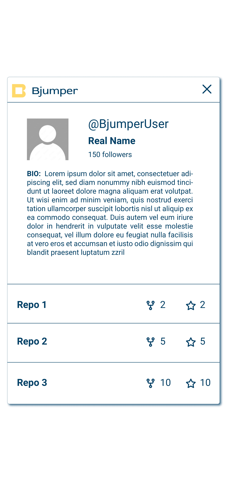
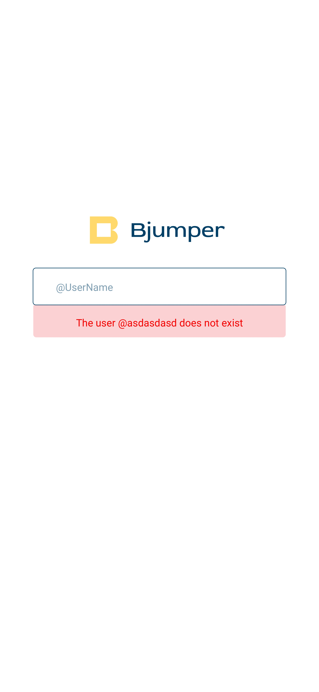

# Tabla de contenidos / Table of Contents
1. [Español](#prueba-de-mobile-bjumper)
   - [Resumen](#resumen)
   - [Requisitos](#requisitos)
   - [Instrucciones](#instrucciones)
   - [Recursos](#recursos)
   - [Criterios de Evaluación](#criterios-de-evaluación)
   - [Entrega](#entrega)
2. [English](#bjumper-mobile-test)
   - [Summary](#summary)
   - [Requirements](#requirements)
   - [Instructions](#instructions)
   - [Assets](#assets)
   - [Evaluation Criteria](#evaluation-criteria)
   - [Submission](#submission)

# Prueba de Mobile Bjumper

## Resumen

Esta prueba está diseñada para evaluar las habilidades de candidatos de mobile con un enfoque en Flutter. El objetivo es crear una aplicación web que permita a los usuarios buscar usuarios de GitHub a través de la [API de GitHub](https://docs.github.com/en/rest).

## Requisitos
1. La aplicación debe ser una app para android
2. La aplicación debe tener una barra de búsqueda que permita buscar un nombre de usuario de GitHub. El criterio de búsqueda debe coincidir exactamente con el nombre de usuario.

3. Si el usuario existe, la aplicación debe mostrar la siguiente información:
   - Avatar del usuario
   - Nombre de usuario
   - Nombre completo
   - Número de seguidores
   - Biografía
   - Una lista de repositorios pertenecientes al usuario. Para cada repositorio, mostrar el número de bifurcaciones (forks) y estrellas.

4. Si el nombre de usuario no existe, la aplicación debe mostrar un mensaje de error indicando que el usuario `[NOMBRE DE USUARIO]` no existe.

## Instrucciones

Se requiere que los candidatos:

1. Crear un nuevo repositorio **privado** en GitHub llamado `Bjumper_Mobile_Test`.
2. Desarrollar una aplicación web que permita buscar usuarios de GitHub.
3. Subir la solución al repositorio creado.

### Recursos
En la carpeta assets de este repo encontrarás distintos iconos que pueden ser útiles para tu propuesta. También encontrarás una propuesta de diseño, aunque puedes aportar tus propias ideas.
Los colores usados en los diseños son:
-  #FFFFFF
-  #034068
-  #FBD1D4
-  #FD110B

## Criterios de Evaluación

Valoramos la calidad sobre la cantidad. Al revisar su presentación, consideraremos lo siguiente:

- **Funcionalidad**: La aplicación debe funcionar según lo esperado y manejar diferentes escenarios de manera elegante.
- **Calidad del Código**: Código bien estructurado, legible y mantenible.
- **Diseño y Experiencia del Usuario**: Aunque no es el enfoque principal, se tomará en cuenta una interfaz limpia y fácil de usar.
- **Documentación**: Instrucciones claras sobre cómo configurar y ejecutar su proyecto son esenciales.
- **Buenas Prácticas**: Cumplimiento con los estándares de la industria y mejores prácticas en la escritura del código y seguridad.

## Entrega

Una vez que haya completado el ejercicio, envíe un correo electrónico con el enlace a su repositorio privado a salcazar@bjumper.com. Si es posible, proporcione acceso temporal al repositorio o incluya un archivo zip del proyecto.

Agradecemos su esfuerzo y tiempo al participar en esta prueba y esperamos con interés revisar su presentación!

---

# Bjumper Mobile Test

## Summary

This test is designed to evaluate the skills of mobile candidates with a focus on Flutter. The goal is to create a web application that allows users to search for GitHub users through the [GitHub API](https://docs.github.com/en/rest).

## Requirements

1. The app must be a Single Page Application
2. The app must have a search bar that allows users to search for a GitHub username. The search criteria must be an exact match of the username.

3. If the user exists, the app must display the following information:
   - User's avatar
   - Username
   - Name
   - Number of followers
   - Bio
   - A list of repositories belonging to the user. For each repository, display the number of forks and stars.

4. If the username does not exist, the app must show an error message stating that the user `[USERNAME]` does not exist.

## Instructions

Candidates are required to:

1. Create a new **private** repository on GitHub named `Bjumper_Mobile_Test`.
2. Develop a web application that enables searching GitHub users.
3. Upload the solution to the created repository.

### Assets
In the assets folder of this repository, you will find various icons that may be useful for your proposal. You will also find a design proposal, although you are welcome to contribute your own ideas.
The colors used in the mockups are:
-  #FFFFFF
-  #034068
-  #FBD1D4
-  #FD110B

## Evaluation Criteria

We value quality over quantity. When reviewing your submission, we will consider the following:

- **Functionality**: The application should work as expected and handle different scenarios gracefully.
- **Code Quality**: Well-structured, readable, and maintainable code.
- **Design and User Experience**: Though not the primary focus, a clean and user-friendly interface will be noted.
- **Documentation**: Clear instructions on how to set up and run your project are essential.
- **Best Practices**: Compliance with industry standards and best practices in coding and security.

## Submission

Once you have completed the exercise, please send an email with the link to your private repository to salcazar@bjumper.com. If possible, provide temporary access to the repository or include a zip file of the project.

We appreciate your effort and time in participating in this test and look forward to reviewing your submission!
